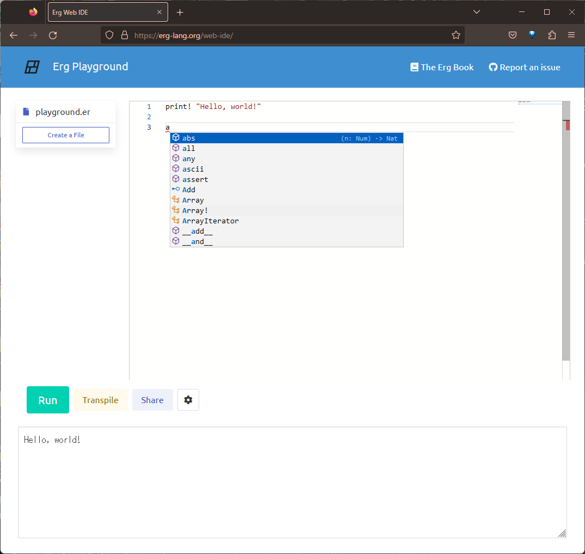

# web-ide

Erg Web IDE

[Try now](https://erg-lang.org/web-ide)



## features

- [x] editor
- [x] pseudo file system
- [x] executing code
- [x] error highlighting
- [x] auto completion

## building

You need to install the Rust toolchain and wasm-pack.

```sh
cargo install wasm-pack
# or
curl https://rustwasm.github.io/wasm-pack/installer/init.sh -sSf | sh
```

```sh
# on Unix
npm run full-build && npm run start
```

```sh
# on Windows
npm run full-build-win && npm run start
```

If you find an error like:

```sh
Module not found: Error: Can't resolve './snippets/rustpython_wasm-1a681ef34bfe87cf/inline1.js' in '...\web-ide\node_modules\erg-playground'
```

move `snippets` folder from `pkg` to `node_modules/erg-playground` (run `npm run copy`).
